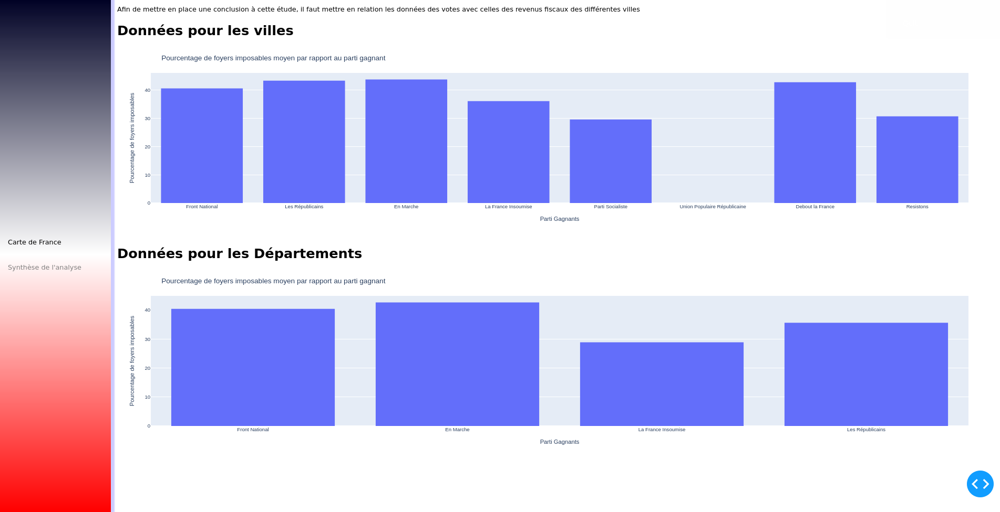

# Python Data Vizualization

## Introduction

L'unité 3I-PR2 Python traite les notions et méthodologies fondamentaux de la programmation en language python. Ce dernier étant un language extrêmement populaire et polyvalent, sa maîtrise est obligatoire pour nous en tant qu'étudiant ingénieur. Cette unité nous propose donc un projet à réaliser pour appliquer nos connaissances acquises en cours et nous familiariser avec la programmation en python.

L'objectif est de créer un dashboard qui représente graphiquement des données publiques. Le sujet étant libre, nous avons décidé d'analyser les résultats de l'élection présidentielle 2017 et de les comparer avec les revenues fiscales de chaque commune. 

Grâce à plusieurs plugins python et l'encadrement de notre enseignant et responsable de l'unité **Daniel Courivaud**, nous avons pu réaliser notre projet. Notre équipe de deux personnes est composée de Baptiste PERRIN et Soufiane MOURCHID.

Ce projet était initialement développé sur github au lien: https://github.com/Armadindon/PythonData

## Installation et initialisation

### 1ère méthode (recommandé)

1. Clonez ce repository.
2. Installez les dépendances. Un fichier requirements.txt est fourni pour l'installation:

```shell
pip install --user -r requirements.txt
```

3. Lancez le script de récuparation des données:

```shell
python3 install.py
```


4. Lancez l'application:
```shell
python3 main.py
```


5. Dans votre navigateur web, visiter le lien: http://127.0.0.1:8050/


#### Installation complète

Cette partie n'est pas nécéssaire, mais si souhaitée, il est possible de re-genérer les données de vote en faisant 

```shell
python3 install.py --full
```

**Attention :** Ce script récupère une grande quantité de données, il faut par conséquent avoir une connexion stable tout au long de l'éxécution de celui-ci, de plus, le temps d'éxécution peut être très lent (Jusqu'a 8h sur un VPS).

### 2ème méthode 

Le site est aussi déployé sur une base docker et accessible à l'adresse: http://elections.bperrin.fr/
Ceci permet de sauter l'installation complètement et donc tester le projet sur n'importe quel appareil. Cependant le temps d'exécution de l'application est trop élevé (3 minutes pour générer la première page). On recommande ainsi de suivre la première méthode. 

## Utilisation et navigation

Au lancement de l'application, on a une vue complète du pays et une répartition par département. Mettre la souris sur un département affiche le parti en tête dans celui-ci.


En cliquant, on génère les communes présentes dans ce département. Cette opération prend un peu de temps, le titre de la page devient "Updating..." durant la génération des nouvelles données.


On a une nouvelle option à gauche de la carte nommé "Info du département". En cliquant sur celle-ci, on a accès aux résultats par candidats et aux données économiques dans le département choisi. On peut retourner à tout moment en appuyant sur l'option "Carte de France".

 

En cliquant sur une commune, on peut accéder au "Info de la ville" maintenant disponible à gauche de la carte.

On peut aussi cliquer à tout moment sur "Synthèse de l'analyse" pour avoir les résultats de l'élection par villes et aussi par départements.

## Structure du projet (Developper guide)

### Assets

Ce dossier contient le fichier css qui permet de changer le style et l'aspect visuel de l'application.

### data

Ce dossier regroupe toutes les données utilisées dans le projet.

#### communes.csv et departement.csv

Le premier fichier liste les informations de communes de France, l'autre liste les départements de France. Ces deux fichiers sont inclus par défaut dans le projet.

#### Fichiers votes_communes.csv et votes_departements.csv

Ils sont générés à l'aide de scripts qui se trouvent dans le dossier dataScripts. Mais vu que ces scripts prennent beaucoup de temps pour générer toutes les données, les 2 fichiers csv en question sont aussi inclus par défaut. Ces fichiers regroupent les résultats de l'élection présidentielle répartie par commune et départements.

#### Revenus Fiscaux
Le dossier Revenues Fiscaux contient un fichier xls pour chaque département. Grâce à un script, on génère deux fichiers csv qui répartit les revenus fiscaux par départements et communes.

### dataScripts

Ce dossier regroupe les scripts qui traitent les données.

1. add_to_communes: Traite des cas spéciaux manquants du fichier communes.csv.
2. get_election_data_by_dept: Génère le fichier votes_départements.csv en obtenant les données de l'elections de 2017 à partir du site de gouvernement: https://www.interieur.gouv.fr/Elections/Les-resultats/Presidentielles/elecresult__presidentielle-2017/
3. get_election_data: même fonction que le script précédent mais classe les données en fonction des communes et non pas en département dans le fichier votes_communes.csv.
4. simplify_geojson: Récupére l'architecture de dossier contenant les GeoJSON et de la simplifier pour le lancement du script.
5. xls_files_to_csv: Convertie les fichiers xls (Excel) des revenus fiscaux vers un fichier csv pour la lecture avec la librairie pandas.

### Panels

Ce dossier regroupe les scripts et objets représentants les différents graphiques du projet.

1. election_map.py: Contient l'objet ChloroMap, une carte Chloropeth permettant d'afficher les données des élections, elle prend en entrée les deux datasets des élections (communes et départements), leurs geojsons respectifs et expose la carte via son attribut map_panel.
2. histogram.py: Contient l'objet VoteHistogram permettant d'afficher un Histogramme avec les données de vote par commune et par candidat, l'objet gère le cas du département et de la commune, il prend en paramètre un dataset, et le numéro de la commune / département à afficher via son attribut "graph".
3. pie.py: Contient l'objet VotePie permettant d'afficher un "Diagramme Camembert" de la répartition des votes dans une commune ou un département, il prend en paramètre un dataset et le numéro de la commune / département à afficher et expose son graphique via son attribut "graph".

### Racine

1. gunicorn_conf: Fichier de configuration pour le serveur gunicorn.
2. install: Script d'installation du projet qui installe les dépendances(données) et formate les fichiers de la manière nécessaire.
3. main: Fichier principal, contient toute la partie propre au fonctionnel de l'application et du serveur.
4. requirements: Liste des dépendances pip à installer.


## Participer au projet

Pour les développeurs souhaitant participer au projet / en savoir plus sur comment travailler sur le projet, merci de se référer à 

## Rapport d'analyse

### Hypothèse de base

Avant l'analyse de résultat, nous pensons que plus le pourcentage de foyers imposables dans un endroit est élevé, plus il y a de chances pour un parti de droite d'être en tête. Et inversement pour les partis de gauche dans les endroits à pourcentage de foyers imposables inférieur.  

### Résultats
Afin de comprendre la corrélation entre les résultats électoralles et les revenus, on utilise la panel synthèse d'analyse:



L'information principale qu'on peut déduire comme initialement prévu de ces deux graphes est que les gens les plus fortunés votent principalement pour les partis de droites, alors que les moins fortunés votent pour les partis de gauche. Ceci est prévisible, vu que les parties socialistes sont plus susceptibles d'attirer des personnes avec des revenues limités au vu de leur programme. Et inversement pour la droite.

Cependant, on peut noter que les communes et département avec le plus haut pourcentage de foyers imposables ont voté pour le parti centriste En Marche ce qui diffère un petit peu de notre hypothèse initiale (qui n'inclus pas le rôle des partis centristes). 

On peut également noter grâce aux données géographiques que des régions proches entres elles sont plus susceptibles de voter au même parti comme on peut le voir avec la grande partie est qui a voté pour le parti Front National , et la grande partie ouest qui a voté pour le parti En Marche. Ce résultat n'était pas inclus dans l'hypothèse de base.


### Critique des résultats

Après l'analyse de nos résultats, on a confirmé que le pourcentage de foyers imposables n'est pas un indicateur très fiable. Cependant, nous avons déjà essayé d'analyser les données à l'aide d'un autre indicateur qui est le revenue fiscal de référence pour un endroit chosi mais nous n'avons pas réussi à avoir des résulats sensés. De plus, on aurait pu utiliser d'autres indicateurs pour avoir des résultats plus précis. On cite l'age de la population, la taille de la population, entre autres.


## Sources :
  * [Résultats de l'élection](https://www.interieur.gouv.fr/Elections/Les-resultats/Presidentielles/elecresult__presidentielle-2017/(path)/presidentielle-2017/index.html)
  * [Liste des départements Français](https://www.data.gouv.fr/fr/datasets/departements-de-france/)
  * [Liste des communes de France](https://www.data.gouv.fr/fr/datasets/communes-de-france-base-des-codes-postaux/)
  * [GeoJson de france](https://github.com/gregoiredavid/france-geojson)
  * [Revenus fiscaux par commune](https://www.data.gouv.fr/fr/datasets/l-impot-sur-le-revenu-par-collectivite-territoriale/)


