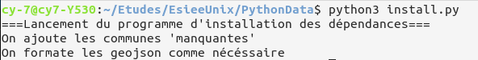

# Python Data Vizualization

## Introduction

L'unité 3I-PR2 Python traite les notions et méthodologies fondamentaux de la programmation en language python. Ce dernier étant un language extrêmement populaire et polyvalent, sa maîtrise est obligatoire pour nous en tant qu'étudiant ingénieur. Cette unité nous propose donc un projet à réaliser pour appliquer nos connaissances acquises en cours et nous familiariser avec la programmation en python.

L'objectif est de créer un dashboard qui représente graphiquement des données publiques. Le sujet étant libre, nous avons décidé d'analyser les résultats de l'élection présidentielle 2017 et de les comparer avec les revenues fiscales de chaque commune. 

Grâce à plusieurs plugins python et l'encadrement de notre enseignant et responsable de l'unité **Daniel Courivaud**, nous avons pu réaliser notre projet. Notre équipe de deux personnes est composée de Baptiste PERRIN et Soufiane MOURCHID.

## Installation et initialisation

### 1ère méthode (recommandé)

1. Clonez ce repository.
2. Installez les dépendances. Un fichier requirements.txt est fourni pour l'installation:

```shell
pip install --user -r requirements.txt
```

3. Lancez le script de récuparation des données:

```shell
python3 install.py
```



4. Lancez l'application:
```shell
python3 main.py
```


5. Dans votre navigateur web, visiter le lien: http://127.0.0.1:8050/


#### Installation complète

Cette partie n'est pas nécéssaire, mais si souhaitée, il est possible de re-genérer les données de vote en faisant 

```shell
python3 install.py --full
```

**Attention :** Ce script récupère une grande quantité de données, il faut par conséquent avoir une connexion stable tout au long de l'éxécution de celui-ci, de plus, le temps d'éxécution peut être très lent (Jusqu'a 8h sur un VPS).

### 2ème méthode 

Le site est aussi déployé sur une base docker et accessible à l'adresse: http://elections.bperrin.fr/
Ceci permet de sauter l'installation complètement et donc tester le projet sur n'importe quel appareil. Cependant le temps d'exécution de l'application est trop élevé (3 minutes pour générer la première page). On recommande ainsi de suivre la première méthode. 

## Utilisation et navigation

Au lancement de l'application, on a une vue complète du pays et une répartition par département. Mettre la souris sur un département affiche le parti en tête dans celui-ci.


En cliquant, on génère les communes présentes dans ce département. Cette opération prend un peu de temps, le titre de la page devient "Updating..." durant la génération des nouvelles données.


On a une nouvelle option à gauche de la carte nommé "Info du département". En cliquant sur celle-ci, on a accès aux résultats par candidats et aux données économiques dans le département choisi. On peut retourner à tout moment en appuyant sur l'option "Carte de France".

 

En cliquant sur une commune, on peut accéder au "Info de la ville" maintenant disponible à gauche de la carte.

On peut aussi cliquer à tout moment sur "Synthèse de l'analyse" pour avoir les résultats de l'élection par villes et aussi par départements.


## Sources :
  * [Résultats de l'élection](https://www.interieur.gouv.fr/Elections/Les-resultats/Presidentielles/elecresult__presidentielle-2017/(path)/presidentielle-2017/index.html)
  * [Liste des départements Français](https://www.data.gouv.fr/fr/datasets/departements-de-france/)
  * [Liste des communes de France](https://www.data.gouv.fr/fr/datasets/communes-de-france-base-des-codes-postaux/)
  * [GeoJson de france](https://github.com/gregoiredavid/france-geojson)
  * [Revenus fiscaux par commune](https://www.data.gouv.fr/fr/datasets/l-impot-sur-le-revenu-par-collectivite-territoriale/)


